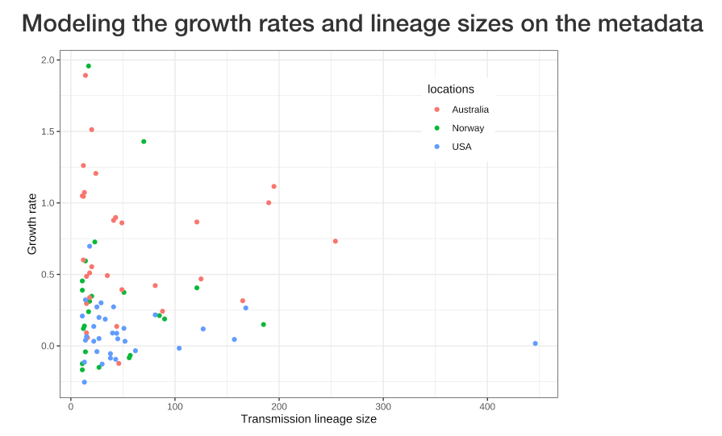

## This webpage describes a subset of the analyses for the paper *The inter-continental population dynamics of Neisseria gonorrhoeae*
 
The aim of this project was to investigate the global transmission dynamics of *Neisseria gonorrhoeae* from 2015 - 2018. To do so we collected a globally diverse sample of sequences a high representation of sequences from Australia (n=2203), Norway (n=1724), the USA (n=2372) and a diverse set of other countries from each continent (n=3434).

### [Transmission lineages and metadata exploration](https://magnunos.shinyapps.io/LineageHomology_Explorer/?_ga=2.205397328.1370338265.1637693506-226041197.1637248825)

The R-shiny app above displays the estimated [transmission lineages](https://www.science.org/doi/10.1126/science.abf2946), size, estimated arrival time, lineage plots and metadata of the sequences belonging to them. To estimate the transmission lineages we have used the R-package [LineageHomology](https://github.com/magnusnosnes/LineageHomology).

### [Import and local transmission analyses](Analyses/03_import_analysis_io.html))

)

This analysis provides estimates of the total number of importation and local transmission events in each location. Additionally we use the transmission lineages to derive importation and local transmission over time. 

### [Growth rate of lineages and relation to metadata](Analyses/04_growth_rate_analysis.html)

This analysis explores the relation of the growth rate of the transmission in the period 2010-2017 and the final size of the transmission lineages, to the metadata of the sequences belonging to those TLs. We extract phylodynamic estimates of the growth rate, and use the lineage size estimated using LineageHomology and run regression analysis to explore the correlation of 

### [Global metadata analysis](Analyses/05_global_analysis.html)

This analysis does not define clades based on the concept of transmission lineages as above, but instead focuses on large clades defined by metadata such as the genes: mtr mosaic and penA mosaic, MIC category (high or low), and sex distribution. We describe the effective population size dynamics in the large clades and relate this to the metadata. 

