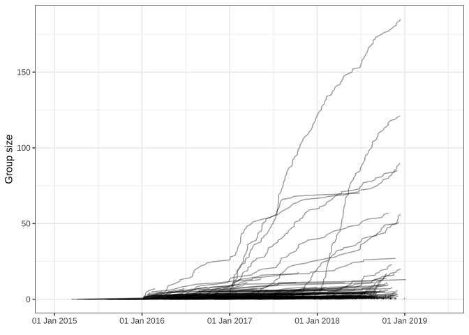
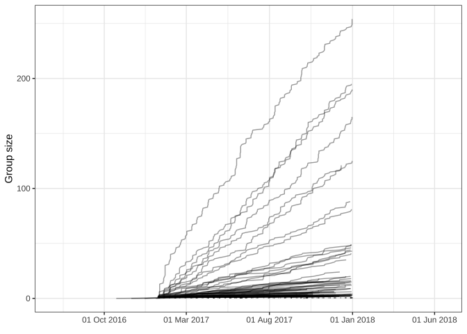
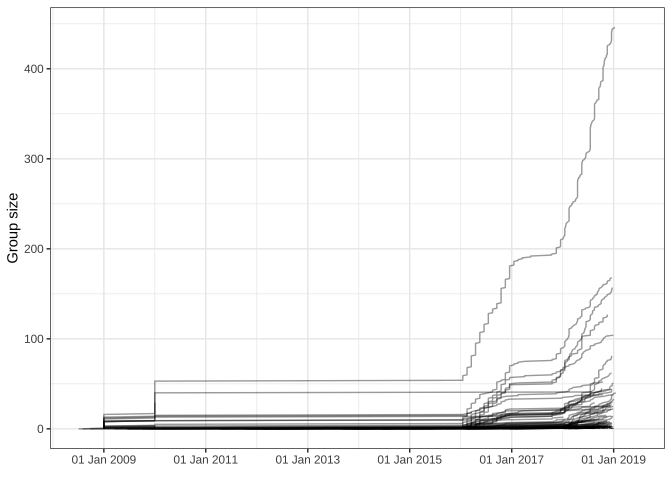

Import analysis and lineage growth analysis
================
Magnus Nygård Osnes
25 jan 2022

The input for this analysis is the results from the maximum likelihood
geographical state mapping on the full phylogenetic tree (obtained from
iqtree 2).

``` r
LineageHomology::Summarize_import_local_transmission(replicates_NOR)
```

    ##                            2.5%          50%        97.5%
    ## Import              498.2000000  507.0000000  514.6000000
    ## Local transmission 1209.4000000 1217.0000000 1225.8000000
    ## Import / Total        0.2889791    0.2940835    0.2984919

``` r
LineageHomology::Summarize_import_local_transmission(replicates_AUS)
```

    ##                            2.5%          50%       97.5%
    ## Import              284.1000000  287.0000000  288.800000
    ## Local transmission 1914.2000000 1916.0000000 1918.900000
    ## Import / Total        0.1289605    0.1302769    0.131094

``` r
LineageHomology::Summarize_import_local_transmission(replicates_USA)
```

    ##                            2.5%          50%        97.5%
    ## Import              303.2000000  306.0000000  314.5000000
    ## Local transmission 2057.5000000 2066.0000000 2068.8000000
    ## Import / Total        0.1278246    0.1290051    0.1325885

``` r
name_date_NOR = name_date[name_date$name%in%nor_tips,]
linfo_NOR = lineage_info(Result_NOR,name_date = name_date_NOR)
LineageHomology::lineage_growth_cumulative(linfo_NOR,datelims=c("2015-01-01","2019-06-15","1 year"))
```

<!-- -->

``` r
name_date_AUS = name_date[name_date$name%in%aus_tips,]
linfo_AUS = lineage_info(Result_AUS,name_date = name_date_AUS)
LineageHomology::lineage_growth_cumulative(linfo_AUS,datelims=c("2016-07-01","2018-06-15","5 months"))
```

<!-- -->

``` r
name_date_USA = name_date[name_date$name%in%usa_tips,]
linfo_USA = lineage_info(Result_USA,name_date = name_date_USA)
LineageHomology::lineage_growth_cumulative(linfo_USA,datelims=c("2009-07-01","2019-06-15","1 year"))
```

<!-- -->
