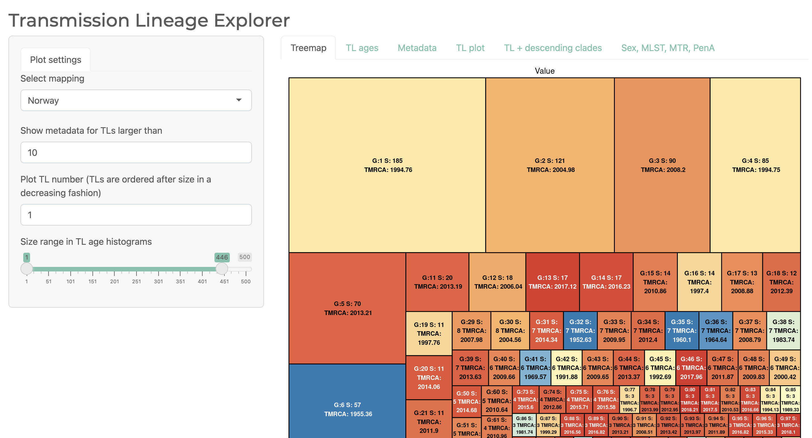

### This repository describes the workflow and analyses of the 1000 genomes of *Neisseria gonorrhoeae*

The aim of this project was investigate global transmission dynamics of Neisseria gorrhoeae in the time period 2015 - 2018. 

#### Data preparation
Data preparation: Collection info, alignment, recombination masking, snp-calling are described in the paper. 

##### Phylogeny
The phylogenetic tree was produced by using [FastTree v.2.1](https://doi.org/10.1371/journal.pone.0009490)
Scaling of the genetic distance to time was done using [LSD2](https://doi.org/10.1093/sysbio/syv068) with two clades constrained to date estimates derived in previous studies (see paper text). 

### [Transmission lineages and metadata exploration](https://magnunos.shinyapps.io/LineageHomology_Explorer/?_ga=2.205397328.1370338265.1637693506-226041197.1637248825)

The estimated geographical distinct lineages ([transmission lineages](https://www.science.org/doi/10.1126/science.abf2946)

### [Import and local transmission analyses]()