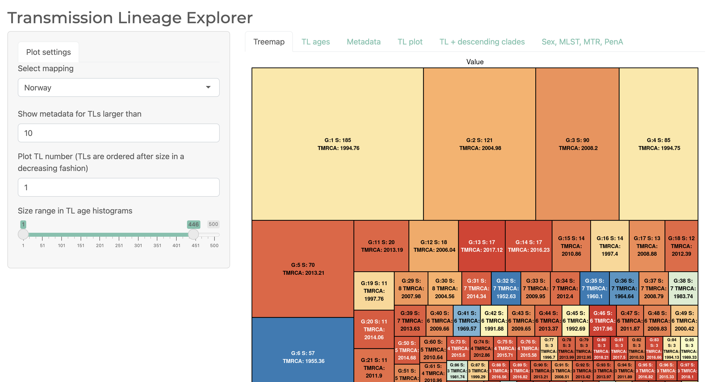
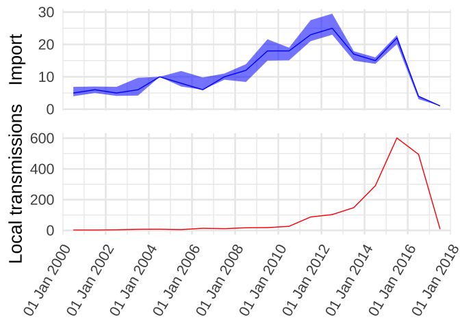

## This webpage describes the workflow and analyses of the 10000 genomes of *Neisseria gonorrhoeae*

The aim of this project investigate global transmission dynamics of Neisseria gonorrhoeae in the period 2015 - 2018. To do so we have collected a globally diverse sample 

#### Data preparation
Data preparation: Collection info, alignment, recombination masking, snp-calling are described in the paper (link will be posted). 

##### Phylogeny
The phylogenetic tree was produced by using [FastTree v.2.1](https://doi.org/10.1371/journal.pone.0009490)
Scaling of the genetic distance to time was done using [LSD2](https://doi.org/10.1093/sysbio/syv068) with two clades constrained to date estimates derived in previous studies (see paper text). 

### [Transmission lineages and metadata exploration](https://magnunos.shinyapps.io/LineageHomology_Explorer/?_ga=2.205397328.1370338265.1637693506-226041197.1637248825)

The estimated geographical distinct lineages [transmission lineages](https://www.science.org/doi/10.1126/science.abf2946). To estimate the Transmission Lineages we have used the R-package [LineageHomology](https://github.com/magnusnosnes/LineageHomology).

### [Import and local transmission analyses](Analyses/LineagesAndImport.html)

