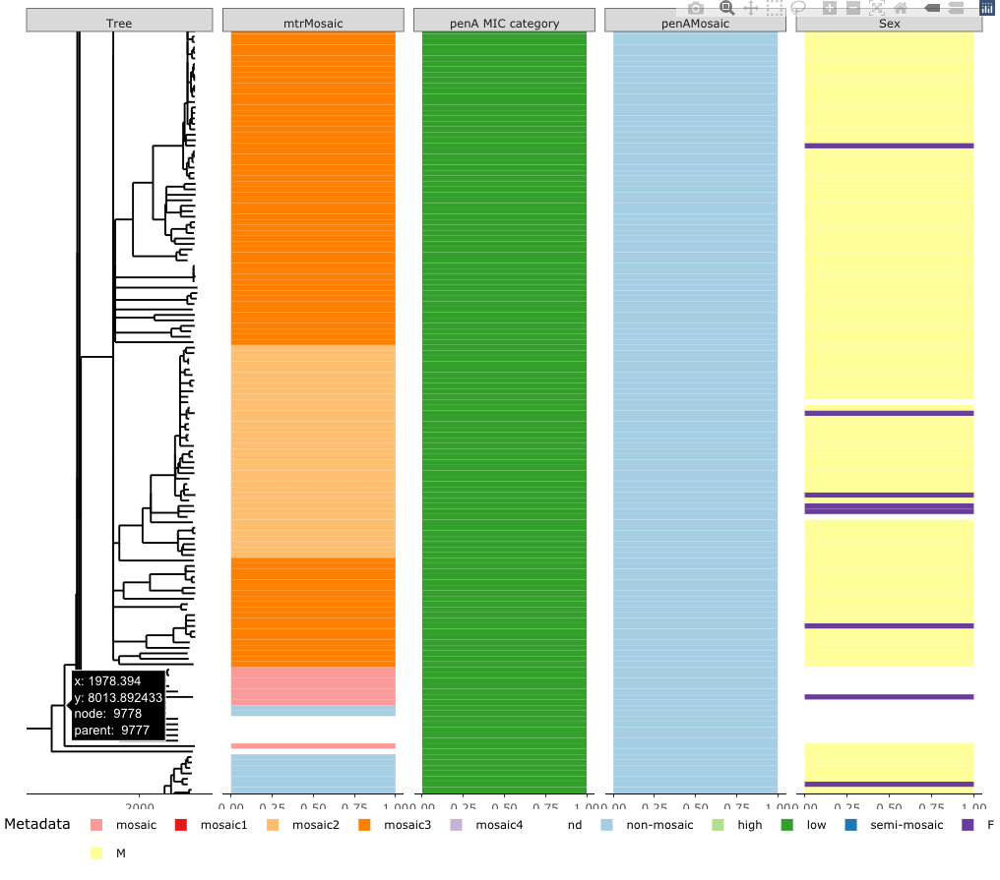

```{r setup, include=FALSE}
knitr::opts_chunk$set(echo = TRUE)

```


```{r, include=FALSE}
#Load required packages and local variables
library(ape)
library(LineageHomology)
library(skygrowth)
library(grid)
library(scales) #Make more axis ticks.
library(gridExtra)
library(ggplot2)
library(phylodyn)
library(pbapply)
library(ggtree)

#Notes:
#Time consuming sections are commented out. The results are saved and loaded on new runs instead of rerunning every time. 
#Had to install an older version of RcppArmadillo to get the script running
#"install.packages("https://cran.r-project.org/src/contrib/Archive/RcppArmadillo/RcppArmadillo_0.9.900.3.0.tar.gz", repos=NULL, type="source")"

#Setup paths
path_main = "~/Dropbox/10000_Lovers/Phylogeography"
path_data = "~/Dropbox/10000_Lovers/01_LineageHomology/11_saved_data/"
path_results = "~/Dropbox/10000_Lovers/01_LineageHomology/12_saved_results/"

source("~/Dropbox/10000_Lovers/01_LineageHomology/sourcefunctions/environment_variables_without_absolute_paths.R")

```

```{r warning=FALSE, include=FALSE}
library(phytools)
library(skygrowth)
library(plotly)

## Better way of doing this is by using a interactive phylogeny app

pdf("~/Dropbox/Testing_folder/tree.pdf",width = 30,height = 30)
plot(tree, show.tip.label = F)
nodelabels(cex =0.25)
dev.off()

#nts: can run the app to find the appropriate node number.
mtrSubtreeNode = 9779
timeShift = 1750+nodeheight(tree, node=9779) #Root time for the subclade. 

#Extract and plot trees
mtrSubtree = extract.clade(tree, node = 9779)
plot(mtrSubtree,show.tip.label = F)
remainder_tree = drop.tip(tree, tip = mtrSubtree$tip.label)
plot(remainder_tree, show.tip.label = F)

#Checking that tree has been split correctly.
length(tree$tip.label); length(remainder_tree$tip.label); length(mtrSubtree$tip.label) 


#   ____________________________________________________________________________
#   Temporary section to save some files, can be removed.                   ####
# plot.phylo(mtrSubtree,show.tip.label=F)
# tmp = metaDataTimeTree[which(metaDataTimeTree$id %in% mtrSubtree$tip.label),]
# mtr_temp = mtr[match_tiplabels_mtrD,]
# metaDataTmp = data.frame("id"=tree$tip.label,
#                               "penaMosaic"= penA$mosaic[match_tiplabels_penA],
#                               "penaMicCategory"= penA$ESC_MIC_category[match_tiplabels_penA],
#                               "Sex"=sample_data$Sex[match_tiplabels], 
#                               "locations" = locations_for_annotation)
# mtr_clade_metadata = cbind(metaDataTmp, mtr_temp)
# mtr_clade_metadata = full_data_tmp[which(metaDataTmp$id %in% mtrSubtree$tip.label),]
# save(mtr_clade_metadata, file="~/Dropbox/10000_Lovers/01_LineageHomology/11_saved_data/mtr_clade_metada.Rdata")
# load(file="~/Dropbox/10000_Lovers/01_LineageHomology/11_saved_data/mtr_clade_metada.Rdata")
# write.csv(mtr_clade_metadata, file="~/Dropbox/10000_Lovers/01_LineageHomology/12_saved_results/mtr_clade_metada.csv")
# read.csv(file="~/Dropbox/10000_Lovers/01_LineageHomology/12_saved_results/mtr_clade_metada.csv")
# write.tree(mtrSubtree, file="~/Dropbox/10000_Lovers/01_LineageHomology/12_saved_results/mtr_clade.nwk")
# mtrSubtree = read.tree( file="~/Dropbox/10000_Lovers/01_LineageHomology/12_saved_results/mtr_clade.nwk")
#   ____________________________________________________________________________
#   End temp section                                                        ####

```

# Global metadata effective population size analysis

we want to describe large clades that differ in some metadata with respect to the rest of the tree. 
First we look at the distribution of mosaic  variants of  the genes mtr and penA, minimum inhibitory concentration (MIC) (categorised into levels high and low) levels,  and  sex  distribution, 

```{r,include=F}
#Define skygrowth with shifted time
source("~/Dropbox/Github/10000_Ngon_genomes/invis_project_functions/Custom_skygrowth_plot.R")
```


```{r echo=F, fig.height=15, fig.width=15, warning=FALSE, include=F}

#   ____________________________________________________________________________
#   Skygrowth on important nodes                                            ####


#sgRemainder = skygrowth.map(remainder_tree)

#sgSubtree = skygrowth.map(mtrSubtree)


#custom_skygrowth_plot(sgSubtree,shift_time = timeShift,logy=T)

#custom_skygrowth_plot(sgRemainder,shift_time = 1750,logy=T)

#Need an app 
#construct consise data
#NB: GGtree needs an "id" for tree tip labels
#Example: #library(TDbook); head(TDbook::df_info)
library(countrycode)
#1: Fond continent of indexs.
#2 If indexes in main locations, use those
#3: Else use the respective continent
#Shade continent 

countries = as.character(sample_data$country[match_tiplabels])
#Arbitrary matching to a country in correct continent
translate = c("Scotland"="France", "Asia"="China", "Caribbean"="Cuba","Brasil"="Argentina")
inds = which(countries %in% c("Asia", "Brasil", "Caribbean", "Scotland"))

countries[inds] = as.vector(translate[as.vector(countries[inds])])
continent <- countrycode(sourcevar = countries,
                            origin = "country.name",
                            destination = "continent")
main_locations =c("Norway","USA", "Australia")

locations_for_annotation = unlist(
  lapply(
    seq_along(countries),
    FUN = function(i) ifelse(countries[i]%in% main_locations, countries[i], continent[i]
                             )))
locations_for_annotation[is.na(locations_for_annotation)]="nd"

#Set up MLST:
#Use the 21 most common categories (since "no data" is one of them).
#Remove remaining categories
MLST_for_annotation = as.character(sample_data$MLST[match_tiplabels])
top_21_mlst = names(sort(table(MLST_for_annotation),decreasing = T))[1:21]; sort(table(MLST_for_annotation),decreasing = T)[23]
hist(sort(table(MLST_for_annotation),decreasing = T)[-c(1,2)])
MLST_for_annotation[(MLST_for_annotation %in% top_21_mlst)==F]="other"


sort(table(sample_data$MLST[match_tiplabels_mtrD]))

metaDataTimeTree = data.frame("id"=tree$tip.label,
                              "penaMosaic"= penA$mosaic[match_tiplabels_penA],
                              "penaMicCategory"= penA$ESC_MIC_category[match_tiplabels_penA],
                              "mtrMosaic"=mtr$mtrD_mosaic[match_tiplabels_mtrD],
                              "mtrindels"=mtr$mtrR_indels[match_tiplabels_mtrD],
                              "Sex"=sample_data$Sex[match_tiplabels], 
                              "locations" = locations_for_annotation,
                              "MLST"=MLST_for_annotation)


#Test on node 11738, alt 11775
#Check structure of metadata
#head(metaDataTimeTree)
#length(match_tiplabels_penA)
#penA$ESC_MIC_category


#   ____________________________________________________________________________
#   Test section:                                                          ####


# testTree = extract.clade(tree, node = 11738)
# testData = metaDataTimeTree[which(metaDataTimeTree$id%in%testTree$tip.label),]
# 
# 
# p = ggtree(testTree)
# str(testData); testData2 = testData[,2:6]; rownames(testData2)=testData$id
# p2 = gheatmap(p,testData2, width=0.3,
#        colnames=FALSE, legend_title="Data")+scale_x_ggtree() +
#    scale_y_continuous(expand=c(0, 0.3))+scale_fill_viridis_d(option="D", name="discrete\nvalue")
# p2
# 
# ggplotly(p2) %>% partial_bundle()

#on full tree
# p=ggtree(tree)
# str(metaDataTimeTree); metaDataTimeTree2 = metaDataTimeTree[,2:6]; rownames(metaDataTimeTree2)=metaDataTimeTree$id
# par(mar=c(0.3,0.3,0.3,0.3))
# g2 = gheatmap(p,metaDataTimeTree2, width=0.3,
#        colnames=F, legend_title="Data")
# g2
# ggplotly(g2)

#   ____________________________________________________________________________
#   Functional                                                              ####
library(ggforce)
library(ggnewscale)
library(RColorBrewer)
p = ggtree(tree, mrsd="2019-08-01")
metdat <- p$data %>%
  dplyr::inner_join(metaDataTimeTree, c('label' = 'id')) #Matches the column of id and tree labels.
metdat$dummy_bar_value = as.numeric(rep(1, nrow(metdat)))

df_bar = data.frame(id=tree$tip.label, dummy_bar_value=rep(1, length(tree$tip.label)))

p1 = p %<+% metaDataTimeTree
cols =  c(brewer.pal(12,"Paired")[-12],"#FFFFFF")

p2 = p1+geom_facet(panel = "mtrMosaic", data =df_bar, geom = geom_col, 
                aes(x = dummy_bar_value,
                fill = mtrMosaic), orientation = 'y', width = 1)+labs(fill = "Metadata")+
  new_scale_color()+
  geom_facet(panel = "penA MIC category", data =df_bar, geom = geom_col, 
                aes(x = dummy_bar_value, fill = penaMicCategory
                ), orientation = 'y', width =1)+
  new_scale_color()+
   geom_facet(panel = "penAMosaic", data =df_bar, geom = geom_col,
                 aes(x = dummy_bar_value, fill = penaMosaic
                 ), orientation = 'y', width =1)+
  new_scale_color()+
   geom_facet(panel = "Sex", data =df_bar, geom = geom_col,
                 aes(x = dummy_bar_value, fill = Sex
                 ), orientation = 'y', width =1)+theme_tree2()+theme(legend.position="bottom")+scale_fill_manual(breaks=c("non-mosaic","semi-mosaic","high","low","mosaic","mosaic1","mosaic2","mosaic3","mosaic4","F","M","nd"),values=cols)#scale_fill_brewer(palette="Paired")


p3=  p1+geom_facet(panel = "mtrMosaic", data =df_bar, geom = geom_col, 
                aes(x = dummy_bar_value,
                fill = mtrMosaic), orientation = 'y', width = 1)+theme(legend.position="bottom")+labs(fill = "Metadata")+
  geom_facet(panel = "penA MIC category", data =df_bar, geom = geom_col, 
                aes(x = dummy_bar_value, fill = penaMicCategory
                ), orientation = 'y', width = 1)+
   geom_facet(panel = "penAMosaic", data =df_bar, geom = geom_col,
                 aes(x = dummy_bar_value, fill = penaMosaic
                 ), orientation = 'y', width = 1)+
   geom_facet(panel = "Sex", data =df_bar, geom = geom_col,
                 aes(x = dummy_bar_value, fill = Sex
                 ), orientation = 'y', width = 1)+theme_tree2()+scale_fill_manual(breaks=c("non-mosaic","semi-mosaic","high","low","mosaic","mosaic1","mosaic2","mosaic3","mosaic4","F","M","nd"),values=cols)#scale_fill_brewer(palette="Paired")


```

### Tree with metadata

The fully annotated tree shows that most of the mosaic variant of mtr clusters in distict part of the tree. 
High HIC categories also clusters in some sections of the tree. 
The sex distribution does not have major evident clusters when we look at the tree as a whole, but in smaller sections of the tree.


```{r, include=T, echo=F,  warning=F,fig.height=15, fig.width=15}
#Adjust the facet_widths. 
p2 = facet_widths(p2, c(Tree=12))
p2
```

## An interactive version of the plot can be explored below

```{r,  include=T, echo=F, warning=F, fig.height=10, fig.width=10}
#Interactive plot
ggplotly(p3) %>% layout(legend=list(x=0, 
                                 xanchor='left',
                                 yanchor='bottom',
                                 orientation='h'))   %>% partial_bundle()
#Haven't found any good way to scale the x-width of the facets yet.
```

### Clades

The pictures below shows subtrees (see interactive plot) we deem important and for which we will estimate the effective population size dynamics.

MTR clusters in the upper part of the tree under node 11506. The estimated time of the most recent common ancestor (TMRCA) of this clade is around 1978.

  
  


The PenA MIC values make up three distict clusters. The first picture shows a clade with an estimated high MIC that carries a mosaic penA gene variant. The estimated tmrca of this clade around 1959.The second clade´s tmrca is around 1976, and has the same MIC and penA mosaic profile, but includes a sub-group with different form of mosaic pen-A (denoted semi-mosaic in the figure in dark blue)
The third clade´s tmrca is approximately 1940 show a clade with high MIC, but non-mosaic penA profile. 

## Population dynamcis in the clades

```{r, echo=F, include=F, fig.height=10, fig.width=10}
#TBD take screemshots of the relevant clades. 
#Extract clade
mtr_clade = extract.clade(tree, node=9778); mtr_clade
penA_highMic_mosaic = extract.clade(tree, node=13077); penA_highMic_mosaic
penA_highMic_mosaic2 = extract.clade(tree, node=12872); penA_highMic_mosaic2
penA_highMic_nonMosaic = extract.clade(tree, node=12427); penA_highMic_nonMosaic

#Run skygrowth on the clades
skyMtr = skygrowth.map(mtr_clade); 
skyhighMic_mosaic = skygrowth.map(penA_highMic_mosaic)
skyhighMic_mosaic2 = skygrowth.map(penA_highMic_mosaic2)
skyhighMic_nonMosaic = skygrowth.map(penA_highMic_nonMosaic)
skyFullTree = skygrowth.map(tree)

```

```{r, echo=F, include=T, fig.height=10, fig.width=10, warning=F}
#Find correct mrsd in subclades
dates = read.csv("~/Dropbox/10000_Lovers/dated_trees/correct_lsd_dates_unmasked.txt",skip = 1, sep=" ")
mtrDates = dates[,2][unlist(lapply(mtr_clade$tip.label, FUN = function(x) which(x==dates[,1])))]
penADates1 = dates[,2][unlist(lapply(penA_highMic_mosaic$tip.label, FUN = function(x) which(x==dates[,1])))]
penADates2 = dates[,2][unlist(lapply(penA_highMic_mosaic2$tip.label, FUN = function(x) which(x==dates[,1])))]
penADates3 = dates[,2][unlist(lapply(penA_highMic_nonMosaic$tip.label, FUN = function(x) which(x==dates[,1])))]
#Check dates. 
#date_decimal(max(mtrDates)); date_decimal(max(penADates1));  date_decimal(max(penADates2)); date_decimal(max(penADates3));

#Plot skygrowth results
g1 = ggtree(mtr_clade,mrsd="2019-07-26")+theme_tree2()+scale_x_continuous(expand=c(0,0),breaks=seq(1980,2020,10))+theme_bw()+ylab("Tree position")+ theme(axis.ticks.y = element_blank())

g2 = ggtree(penA_highMic_mosaic,mrsd="2019-01-06")+theme_tree2()+scale_x_continuous(expand=c(0,0),breaks=seq(1960,2020,10))+theme_bw()+ylab("Tree position")

g3 = custom_skygrowth_plot(skyMtr,shift_time=1978.394, logy=F)+ggtitle("Mosaic mtr",)+scale_x_continuous(expand=c(0,0),breaks=seq(1980,2020,10))+
  theme(plot.title = element_text(hjust = 0.5))

g4 = custom_skygrowth_plot(skyhighMic_mosaic, shift_time=1958.606, logy=F)+ggtitle("High MIC mosaic penA")+scale_x_continuous(expand=c(0,0),breaks=seq(1960,2020,20))+
  theme(plot.title = element_text(hjust = 0.5))


grid.arrange(g1,g2,g3,g4,ncol=2)


```
 
## TBD
 
```{r, echo=F, include=T, fig.height=10, fig.width=10, warning=F}
g5 = ggtree(penA_highMic_mosaic2,mrsd="2018-11-02")+theme_tree2()+scale_x_continuous(expand=c(0,0),breaks=seq(1970,2020,10))+theme_bw()+ylab("Tree position")+ theme(axis.ticks.y = element_blank())

g6 = ggtree(penA_highMic_nonMosaic,mrsd="2019-07-20")+theme_tree2()+scale_x_continuous(expand=c(0,0),breaks=seq(1940,2020,20))+theme_bw()+ylab("Tree position")+theme(axis.ticks.y = element_blank())

g7 = custom_skygrowth_plot(skyhighMic_mosaic2, shift_time=1976.498, logy=F)+scale_x_continuous(expand=c(0,0),breaks=seq(1980,2020,10))+ggtitle("High MIC mosaic penA other clade")+
  theme(plot.title = element_text(hjust = 0.5))

g8 = custom_skygrowth_plot(skyhighMic_nonMosaic, shift_time=1940.751, logy=F)+ggtitle("High MIC non-mosaic penA")+scale_x_continuous(expand=c(0,0),breaks=seq(1940,2020,20))+theme_bw()+
  theme(plot.title = element_text(hjust = 0.5))


grid.arrange(g5,g6,g7,g8,ncol=2)


```

All of the clades grew in the period 1980-2010. After 2010 the effective population size falls for all the clades define by penA variants, while mtr continues growing or alternatively stablizes. 
The effective population size in the tree as a whole is shown below. The clades from above are highlighted.

```{r, echo=F, include=T, fig.height=10, fig.width=10, warning=F}
g5 = custom_skygrowth_plot(skyFullTree, shift_time=1750, logy=F)+ggtitle("Full Tree")+
  theme(plot.title = element_text(hjust = 0.5))+scale_y_continuous(limits=c(0,20000), oob=rescale_none)+scale_x_continuous(breaks=seq(1750,2020,20),expand=c(0,0))

g6 = ggtree(tree,mrsd="2019-08-01")+theme_tree2()+scale_x_continuous(breaks=seq(1750,2020,20),expand=c(0,0))+theme_bw()+ylab("Tree position")+theme(axis.ticks.y = element_blank())+geom_highlight(node=9778,fill="green")+geom_highlight(node=9778,col="lightgreen")+
  geom_highlight(node=13077,fill="steelblue")+
  geom_highlight(node=12872,fill="yellow")+
  geom_highlight(node=12427,fill="red")

grid.arrange(g6,g5,ncol=1)
```

The high effective population size from 1770-1800 is a result of the long basal branches which probably displays a lack of sequences that represent the divergence that happened in this time period. 
From 1810-2010 the effective population size have been steadily growing, with a pronounced decrease since 2010.

```{r,  include=F, echo=F, warning=F, fig.height=10, fig.width=10}


#   ____________________________________________________________________________
#   Results                                                                 ####


#   ____________________________________________________________________________
#   Figure 1                                                                ####


source("~/Dropbox/Github/10000_Ngon_genomes/invis_project_functions/Annotation_w_settings.R")

#svglite
pdf(paste0(path_results,"/02_Figure_2/annotated_phylogeny_without_location.pdf"), width=15,height=15, onefile = F)
p2 = annotate(tree, size=0.2)
p2
dev.off()

#dev.off()

#Figure 1: panel B:
pdf(paste0(path_results,"/02_Figure_2/skygrowth_full_tree.pdf"), width=10,height=7) 
custom_skygrowth_plot(skyFullTree, shift_time=1750, logy=F, fill_color = "black")+ggtitle("Full Tree")+
  theme(plot.title = element_text(hjust = 0.5))+scale_y_continuous(limits=c(0,20000), oob=rescale_none)+scale_x_continuous(breaks=seq(1750,2020,20),expand=c(0,0))
dev.off()
#Plot skygrowth results
source("~/Dropbox/Github/10000_Ngon_genomes/invis_project_functions/subtree_plots.R")

#Figure 1: panel C:
#Clade:
pdf(paste0(path_results,"/02_Figure_2/clades_1_2.pdf"), width=10,height=10)
subtree_plots1(color1="#E69F00", color2="#56B4E9")
dev.off()
#Clade:
pdf(paste0(path_results,"/02_Figure_2/clades_3_4.pdf"), width=10,height=10)
subtree_plots2(color1="#009E73", color2="#CC79A7")
dev.off()


#   ____________________________________________________________________________
#   Testing section                                                         ####

# 
# ##Test ggtree and phylo node labeling: 
# test_tree = rtree(10)
# 
# ggtree(test_tree)+geom_text2(aes(subset=!isTip, label=node), hjust=-.3)+geom_tiplab()
# 
# plot.phylo(test_tree)
# nodelabels()


#LOAD LIBS ---------------------------------------------------------------
# library(ape)
# library(ggtree)
# library(plotly)
# #CREATE A TREE -------------------------------------------------------------
# n_samples <- 20
# n_grp <- 4
# tree <- ape::rtree(n = n_samples)
# #CREATE SOME METADATA ----------------------------------------------------
# id <- tree$tip.label
# set.seed(42)
# grp <- sample(LETTERS[1:n_grp], size = n_samples, replace = T)
# dat <- tibble::tibble(id = id,
#                      grp = grp, dummy_bar_value = rep(1, length(grp)))
# #PLOT THE TREE -----------------------------------------------------------
# p1 <- ggtree(tree)
# metat <- p1$data %>%
#  dplyr::inner_join(dat, c('label' = 'id'))
# 
# df_bar = data.frame(id=metat$label, dummy_bar_value=rep(1, length(grp)))
# 
# p2 <- p1
# p2 = p2 %<+% metat
# 
# p2 = p2+geom_facet(panel = "Trait1",data =df_bar, geom = geom_col,
#                  aes(x = df_bar$dummy_bar_value, fill = grp
#                  ), orientation = 'y', width = 1)+
#   geom_facet(panel = "Trait2",data =df_bar, geom = geom_col,
#                  aes(x = df_bar$dummy_bar_value, fill = grp
#                  ), orientation = 'y', width = 1)+theme_tree2()
# p2
# #Scale metadata axis -----------------------------------------------------------
# 
# ggplotly(p2) #Works fine!
# 
# p3=facet_widths(p2,c(Tree=12))
# p3 #Metadata looks great
# 
# ggplotly(p3) #The scaled version doesn't work with plotly.

# Warning message:
# In geom2trace.default(dots[[1L]][[1L]], dots[[2L]][[1L]], dots[[3L]][[1L]]) :
#   geom_GeomCustomAnn() has yet to be implemented in plotly.
#   If you'd like to see this geom implemented,
#   Please open an issue with your example code at
#   https://github.com/ropensci/plotly/issues

#+
  # geom_facet(panel = "Trais2", data =df_bar, geom = geom_col,
  #                aes(x = dummy_bar_value, fill = Sex
  #                ), orientation = 'y', width = 1)


#Test
## load `tree_nwk`, `df_info`, `df_alleles`, and `df_bar_data` from 'TDbook'
# tree <- tree_nwk
# df_bar_data$dummy_bar_value=rep(1, length(df_bar_data$dummy_bar_value)) #Remove to get back real data
# ## visualize the tree 
# test3 <- ggtree(tree) 
# 
# ## attach the sampling information data set 
# ## and add symbols colored by location
# test3 <- test3 %<+% df_info
# 
# ## visualize SNP and Trait data using dot and bar charts,
# ## and align them based on tree structure
# t3 = test3 +
#     geom_facet(panel = "Trait", data = df_bar_data, geom = geom_col, 
#                 aes(x = dummy_bar_value, color = location, 
#                 fill = location), orientation = 'y', width = .6) 
# t3
# +
#     theme_tree2(legend.position=c(.05, .85))

# +
# geom_facet(panel = "Trait2", data = df_bar_data, geom = geom_col, 
#                 aes(x = dummy_bar_value, color = location, 
#                 fill = location), orientation = 'y', width = .6)
  
# t3
# #Make it interactive
# ggplotly(t3)


#   ____________________________________________________________________________
#   Test station 2                                                          ####


# myTest = ggtree(testTree)
# metdat <- myTest$data %>%
#   dplyr::inner_join(testData, c('label' = 'id')) #Matches the column of id and tree labels.
# metdat$dummy_bar_value = as.numeric(rep(1, nrow(metdat)))
# metdat=as.data.frame(metdat)
# 
# myTest = myTest %<+% metdat
# 
# df_bar_data2 = data.frame(id=testTree$tip.label, dummy_bar_value=rep(1, length(testTree$tip.label)))
# df_bar_data2
# head(df_bar_data2)
# head(df_bar_data)
# #Compared with mine:
# myTest = myTest+geom_facet(panel = "Trait", data =df_bar_data2, geom = geom_col,
#                 aes(x = df_bar_data2$dummy_bar_value, color = mtrindels,
#                 fill = mtrindels), orientation = 'y', width = 0.8)
# 
# myTest= facet_widths(myTest, c(Tree=5))
# myTest
#   ____________________________________________________________________________
#   This was too slow                                                      ####

# myTest = ggtree(testTree) 
# metdat <- myTest$data %>%
#   dplyr::inner_join(testData, c('label' = 'id')) #Matches the column of id and tree labels.
# metdat$dummy_bar_value = as.integer(rep(1, nrow(metdat)))
# pp = myTest+geom_tippoint(data=metdat,aes(x=x,y=y,colour=penaMosaic))#+geom_facet(panel="Test",data = testData, geom=geom_col,aes(color=penaMosaic))
# 
# pp+geom_facet(panel = "Trait", data =metdat, geom = geom_col, 
#                 aes(x = dummy_bar_value, color = mtrMosaic, 
#                 fill = mtrMosaic), orientation = 'y', width = .6)
# #geom_facet(data=metdat, panel="Test",geom=geom_col,aes(x=x,y=y,colour=penAMicCategory))
# gheatmap(myTest,metdat)
# ggplotly(pp)


```

